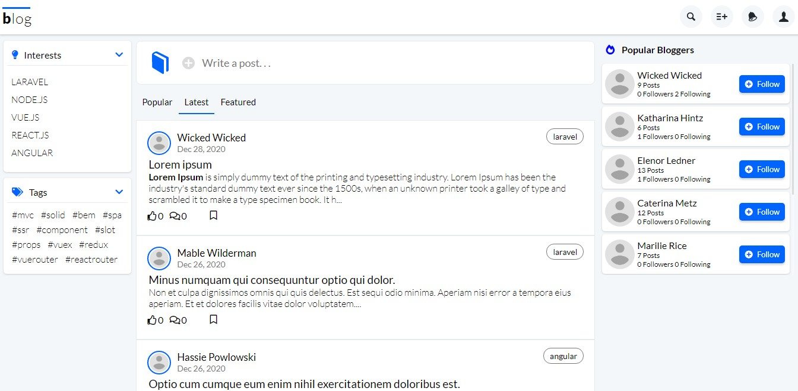

<!-- WEBSITE NAME -->
# blog

<!-- WEBSITE SCREENSHOT -->


<!-- ABOUT THE PROJECT -->
### About The Project

**blog** is a simple social media website where in you can register account and post your thoughts, ideas, knowledge, or anything related on the interest you choose. You can also comment on other user posts, bookmark posts for later reading, and like posts that you like.

List of some of its functionalities
* Register account
* Posts anything related on the chosen category, with appropriate tags, and optional featured image.
* Optionally save post as draft or publish it directly. 
* Option to trash, restore, and permanently delete personal posts.
* Comment on other users posts.
* Like other users posts.
* Bookmark posts of other users.
* Follow other users and get notified on their next posts.
* Mark post as featured post.

### Built With

* [Laravel](https://laravel.com)
* [Vue.js](https://vuejs.org)
* [Vue2Editor](https://www.vue2editor.com/)
* SASS

<!-- GETTING STARTED -->
### Getting Started

To get started setting up your project locally. To get a local copy up and running follow these simple steps.

### Prerequisites
Assuming you have already installed latest php, composer, node.js, npm, and git on your computer

### Installation

1. Clone the repo
   ```sh
   git clone https://github.com/wickeddd3/Blog.git
   ```
2. Install Composer packages
   ```sh
   composer install
   ```
3. Install NPM packages
   ```sh
   npm install
   ```
4. Create a copy of .env.example and rename it to .env
5. Inside .env fill up Database and Mail details.
   For development purposes you can use Mailtrap (https://mailtrap.io)
   as mail host.
6. Generate APP_KEY
   ```sh
   php artisan key generate
   ```
7. Run locally
   ```sh
   php artisan serve
   ```
8. Compile assets
   ```sh
   npm run watch
   ```

<!-- CONTRIBUTING -->
### Contributing

Contributions are what make the open source community such an amazing place to be learn, inspire, and create. Any contributions you make are **greatly appreciated**.

1. Fork the Project
2. Create your Feature Branch (`git checkout -b feature/AmazingFeature`)
3. Commit your Changes (`git commit -m 'Add some AmazingFeature'`)
4. Push to the Branch (`git push origin feature/AmazingFeature`)
5. Open a Pull Request

<!-- CONTACT -->
### Contact

Philip - [https://www.linkedin.com/in/philip-andrew-pablo-501203180/](https://www.linkedin.com/in/philip-andrew-pablo-501203180/)

Project Link: [https://github.com/wickeddd3](https://github.com/wickeddd3)
